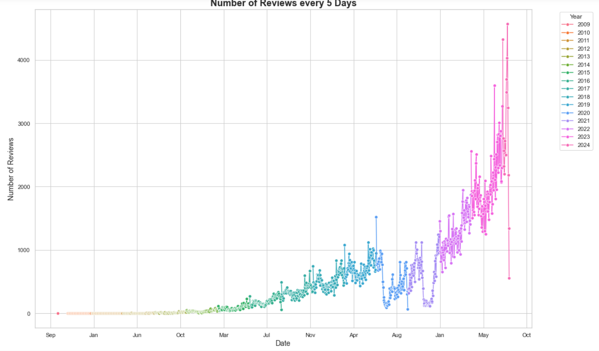
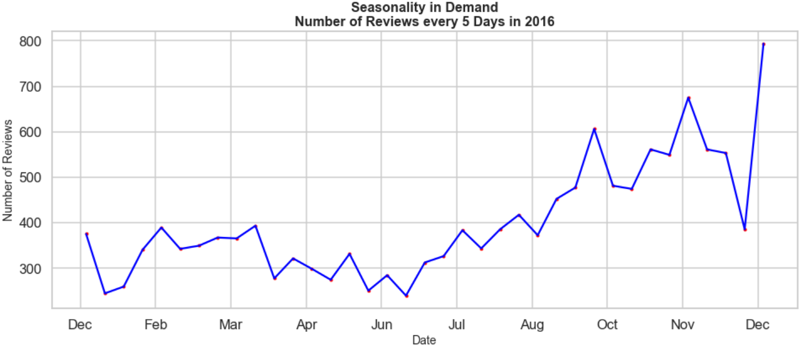
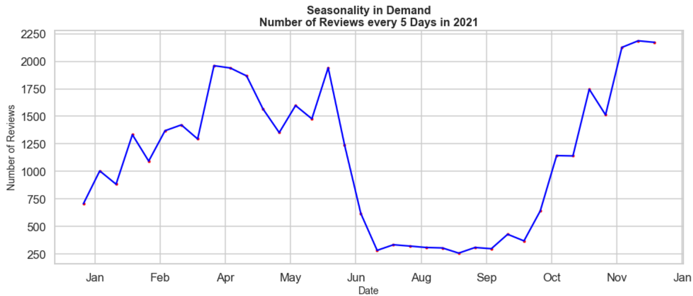

  # Airbnb Analysis
  **Abstract**:We first conducted an exploratory analysis of the data, then conducted relevant time series analysis, discovered quarterly changes in housing popularity, built multiple models for detailed regression analysis and testing, built a recommendation system based on the data, and, based on reviews, drew a word cloud diagram.

**Keywords**: EDA, time series analysis, regression, recommendation
system

## 1. Exploratory Data Analysis

This section provides an overview of the project’s objective, which is
to analyze data sourced from the provided dataset Airbnb,which outlines
the key areas of analysis, including market distribution, factors
influencing house prices, room popularity, factors affecting listing
room acceptance, and also encapsulates the additional analyses performed
to further understand the dynamics of the Airbnb market, particularly in
the context of Sydney listings.

### Market size relation analysis

<figure>

<figcaption aria-hidden="true">Market size among different
location</figcaption>
</figure>

The pie chart below show this information for market size in Sydney.
Note that Sydney city area has the most proterty for booking. The top
five are Sydney City, Waverley, Pittwater，Randwick, Warringah.

### Room type relation analysis

<figure>

<figcaption aria-hidden="true">Market size among different room
type</figcaption>
</figure>

Entire room/apt has the biggest market size in all 4 types of rooms.  
But Does the rooms type really affect the number of booking?

<figure>

<figcaption aria-hidden="true">Booking count in different
type</figcaption>
</figure>

It seems Entire home / apt have a much higher booking than other types
of rooms.But let’s also see the ration of booking numbers to total
market size of each roomtype.

<figure>

<figcaption aria-hidden="true">Booking count proportion in different
type</figcaption>
</figure>

Through the ratio of booking number and total number of their room type,
hotel shows more popular, and shared room is not very popular. Entire
home/apt has the most booking number just because the quantity of this
room type in airbnb is the most available type.

### Time relation series with listing and review number trend by room type

<figure>

<figcaption aria-hidden="true">Listing Growth Trend</figcaption>
</figure>

We assume the listing time is the first review time.Then we find:From
2014, the Markt size become rapidly expanding. Especially Entire
home/apt and Private room.After covid-19 pandamics outbreak about 2020,
all type of room new listings decrease greatly. After the epidemic, 2022
began to pick up translation.

<figure>

<figcaption aria-hidden="true">Review number growth trend</figcaption>
</figure>

From the chart, The outbreak of the pandemic has a very huge impact on
the check in rate. Especially during the lockdown period, check in
dropped sharply, but after lockdown terminated at the end of October,
check in appeared huge rebound.

### Price relation analysis

<figure>

<figcaption aria-hidden="true">Median Price Trend</figcaption>
</figure>

<figure>

<figcaption aria-hidden="true">Mean Price Trend</figcaption>
</figure>

No particular trend in prices over time can be seen from the chart both
in mean and median.

<figure>

<figcaption aria-hidden="true">Price in different location by room
type</figcaption>
</figure>

<figure>

<figcaption aria-hidden="true">Median Price by Room Type</figcaption>
</figure>

Above we plot the meadian price distribution,next we will show price
range for different room type.

<figure>

<figcaption aria-hidden="true">Entire home/apt Price range in different
Location</figcaption>
</figure>

<figure>

<figcaption aria-hidden="true">Hotel room Price range in different
Location</figcaption>
</figure>

<figure>

<figcaption aria-hidden="true">Private room Price range in different
Location</figcaption>
</figure>

<figure>

<figcaption aria-hidden="true">Shared room Price range in different
Location</figcaption>
</figure>

Entire home / apt and hotel has much higher median price than others.

### Features analysis which affect the popularity of room

<figure>

<figcaption aria-hidden="true">Number of reviews-scatter
plot</figcaption>
</figure>

From The following interactive chart, it shows price and location will
impact if a room is popular or not. Popular room’s price usually below
500, secondly, when we hover over the scatter, we will show the area
where the corresponding point is located, and find out whether it is in
the urban area is also an important factor affecting the popularity of
the house;Popular room’s the location is not far away form city.

### Sydney area futhermore analysis

Next,based on previous analysis, Sydney City area has the largest market
share. We will do some analysis based on this area.

<figure>

<figcaption aria-hidden="true">Distribution of bedrooms in listing
room</figcaption>
</figure>

1 bedroom make up the majority of listings

<figure>

<figcaption aria-hidden="true">Relationship between room type and price
in Sydney city area</figcaption>
</figure>

Entire home/apt , hotel room and Private room have much higher price
than Shared room.  
Then we are curious about whether there exists price trend in these
select feature(Sydney city, entire home/ apt, 1 bedroom)?

<figure>

<figcaption aria-hidden="true">1 Bedroom Entire Home Apt Median Price
Trend in Sydney City Area</figcaption>
</figure>

We find no particular trend in prices over time can be seen from the
chart.  
Then we conduct a host relation analysis-Changes in the number of hosts
settled and listings in Airbnb in Sydney over time.

<figure>

<figcaption aria-hidden="true">Total hosts and total listings in Airbnb
by year</figcaption>
</figure>

<figure>

<figcaption aria-hidden="true">New hosts and new listings in Airbnb by
year</figcaption>
</figure>

From the above chart, from 2014-2016, hosts settled in Sydney airbnb
expand rapidly. From 2017, growth of new hosts settled become slowly,
but listings still increase fast,especially in 2023  
Why is there an increase in listings when there are fewer new hosts?

<figure>

<figcaption aria-hidden="true">Hosts top 10 now and 2019</figcaption>
</figure>

Some hosts hold a large percentage of the market share from the above
analysis(such as MadeComfy), maybe that is why from 2017, the host
increase slow, but the number of listings still growth fast.

<figure>

<figcaption aria-hidden="true">Hosts top 10 now and 2019</figcaption>
</figure>

Here is business growing trend among almost Top3.This confirms the
previous findings,although the total number of bookings is relatively
stable, this trend is still preserved:from 2014-2016, hosts settled in
Sydney airbnb expand rapidly. From 2017, growth of new hosts settled
become slowly.

### Trend Analysis

In this section, we will analyse the demand for Airbnb listings from the
dataset. We will look at demand over the years since the inception of
Airbnb in 2009 and across months of the year to understand seasonlity.
We also wish to establish a relation between price and demand. The
question we aspire to answer is whether prices of listings fluctuate
with demand.We will also look at how prices change and fluctuate in
different months of the year. To study the demand, since we did not have
data on the bookings made over the past year, we will use ‘number of
reviews’ variable as the indicator for demand. As per Airbnb, most of
guests review the listings, hence studying the number of review will
give us a good estimation of the demand.

### How popular is Airbnb?

<figure>

<figcaption aria-hidden="true">How popular is Airbnb?</figcaption>
</figure>

The number of reviews for Airbnb listings has shown a significant
exponential increase over the years, indicating a substantial rise in
demand since Airbnb’s inception in 2009. This growth suggests that the
platform has become increasingly popular among travelers.

<figure>

<figcaption aria-hidden="true">Different years with different
colors</figcaption>
</figure>

In this graph, the data for different years are represented by different
colors. One can observe that number of reviews/demand also depicts a
seasonal pattern. Every year there are peaks and drop in the demand,
indicating that certain months are busier compared to the others.

Let us look at monthly demands for each of the years.

Trend Plot

Trend Plot

Demand for Airbnb listings is not uniform throughout the year. There are
noticeable seasonal patterns, with certain months experiencing higher
demand. For instance, the data indicates that demand is generally lower
in the middle months of the year and increases towards October. This
seasonal fluctuation can be linked to several factors:

-   **Tourism Seasons:** In regions where tourism is seasonal, demand
    for Airbnb listings spikes during peak tourist seasons. For example,
    spring and winter might be more popular due to favorable weather
    conditions and holiday seasons.

-   **Holiday Periods:** Months that include major holidays, such as
    December with Christmas and New Year’s, see higher demand as people
    travel for vacations and family gatherings.

To mathematically validate the initial observations, a time series
analysis was conducted on the review data.

### Step I:Time Series Decomposition

1.  **Trend Component and Seasonal Component:** The trend component
    extracted from the time series decomposition indicates a consistent
    increase in the number of reviews over time, and The seasonal
    component reveals regular patterns that repeat annually

2.  **Residuals:** The residuals show the remaining variability in the
    data after removing the trend and seasonal components.

     

### Step II:Autocorrelation and Partial Autocorrelation

To further understand the underlying patterns, autocorrelation (ACF) and
partial autocorrelation (PACF) functions were plotted. These plots help
identify the dependencies between observations at different lags.

 

### Step III:ARIMA Model

An ARIMA (1,1,1) model was fitted to the time series data to capture the
autoregressive and moving average components.

-   AR(1) Coefficient: 0.5401 (p \< 0.001)

-   MA(1) Coefficient: -0.9637 (p \< 0.001)

-   Model Summary

     

### Step IV: Forecasting Results

The forecast from the ARIMA model aligns well with the original data,
capturing the upward trend and seasonal fluctuations.

 

The time series analysis confirms the initial conclusions drawn from
visual inspection. The number of reviews for Airbnb listings has been
increasing exponentially, reflecting growing popularity. The seasonal
decomposition and ARIMA model provide a robust mathematical validation
of these trends and seasonal patterns, further supporting the
observation that Airbnb has become a preferred accommodation choice for
travelers worldwide.

<figure>

<figcaption aria-hidden="true">Different years with different
colors</figcaption>
</figure>

This pattern is also reflected in the availability of listings, with the
number of unavailable listings (indicating booked properties) increasing
during high-demand months. In above figure, the orange parts show the
number of monthly unavailable listings and the green parts show the
number of available listings, which also confirms the above conclusion
from month to month

### How is Airbnb priced across the year?

Let’s start by drawing the monthly average listings price curve for each
year in one figure and try to find the trend.

<figure>

<figcaption aria-hidden="true">Different years with different
colors</figcaption>
</figure>

One year the price curve was too curved, so the overall picture is not
significant.So we try to calculate the average curve for each year. On
the other hand, this means price fluctuations will not be particularly
large generally

<figure>

</figure>

The pricing of Airbnb listings also shows distinct trends throughout the
year. By analyzing the monthly average listing prices for each year, we
observe:

-   **Lower Prices in Mid-Year:**

-   **Price Increase Towards Year-End:**

-   **Volatility and Stabilization:**

The correlation between price and demand is evident but not very strong.
And then we’ll test that claim mathematically.

### Part I:ANOVA Analysis

To further analyze the price volatility across different months, we
conducted an ANOVA test to determine if there are significant
differences in listing prices across months. The results showed
significant differences in prices, indicating that the month of the year
does impact Airbnb listing prices.

<figure>

<figcaption aria-hidden="true">ANOVA Table</figcaption>
</figure>

<figure>

<figcaption aria-hidden="true">Boxplot of price</figcaption>
</figure>

The boxplot above, with outliers removed, visually confirms the
significant differences in prices across months, with notable peaks and
troughs aligning with holiday seasons and tourist patterns.

### Part II:Time series Analysis

We also performed a time series analysis to observe the impact of
seasonality on Airbnb listing prices. By decomposing the time series
into trend, seasonal, and residual components, we observed the
following:

<figure>

<figcaption aria-hidden="true">Boxplot of price</figcaption>
</figure>

<figure>

<figcaption aria-hidden="true">Seasonal Component</figcaption>
</figure>

The seasonal component clearly shows recurring patterns within the year,
indicating higher prices during certain months (e.g., peak holiday
seasons) and lower prices during off-peak months.

### Part III:Rolling 12-Month Standard Deviation:

The plot of the rolling 12-month standard deviation shows the changes in
price volatility over time.

<figure>

<figcaption aria-hidden="true">Seasonal Component</figcaption>
</figure>

Periods with a higher rolling standard deviation indicate greater price
volatility, while periods with a lower rolling standard deviation
indicate less price volatility. Below is the result of Augmented
Dickey-Fuller (ADF) :

-   **Test Statistic:** -1.8739

-   **p-value:** 0.3444

-   **Critical Values:**

    -   1%: -3.5079

    -   5%: -2.8954

    -   10%: -2.5848

The ADF test results show that there is no significant downward trend in
price volatility.

### Geographical location analysis

This part presents a detailed analysis of location visualization and
various neighborhood characteristics. The study includes a comprehensive
examination of house number distribution, price analysis, review scores,
and room type distribution across different neighborhoods.

### Neighborhood Analysis

Figure illustrates the distribution of house counts across different
neighborhoods. The color intensity varies according to the house count,
with darker colors representing higher counts.

<figure>

<figcaption aria-hidden="true">House Count by Nerghborhood</figcaption>
</figure>

The figure shows that 21 neighborhoods are included. The average house
count across these neighborhoods is around 47. The smallest neighborhood
consists of 3 houses. While 75% of the neighborhoods contain 46 or fewer
houses, the neighborhood with the maximum number of houses is Sydney,
which has significantly more than the others.

Here I use the Folium package in Python to create an interactive map.
This map visualizes the distribution of housing listings across the
city. [Cluster Map](https://easylink.cc/7cs9xg)

The map provides an intuitive way to understand the spatial distribution
of properties and identify areas with high or low densities of listings.
The interactive map clearly reveals a significant concentration of
houses in Sydney, evidenced by the large number of clusters in this
area. Users can click on any area of interest to zoom in and view the
detailed distribution of housing listings within that specific
geographic region. This functionality allows for an in-depth exploration
of the spatial patterns and densities of listings.

### Price Distribution Analysis

In this part, a One-way ANOVA was initially conducted to analyze the
price differences across various neighborhoods. However, the test
revealed that the homogeneity of variance assumption was not
satisfied(p-value \< 0.05), indicating that the variability in house
prices is not consistent across all neighborhoods.

<figure>

<figcaption aria-hidden="true">Heteroscedasticity Test</figcaption>
</figure>

Due to the failure of the homogeneity of variance in the One-way ANOVA,
a Kruskal-Wallis test was conducted. This non-parametric test does not
assume equal variances and is suitable for comparing price distributions
across multiple neighborhoods. The results provided a more reliable
comparison of house prices, identifying significant differences between
neighborhoods. You can see in the Figure below:

<figure>

<figcaption aria-hidden="true">Price Distribution By
Neighborhoods</figcaption>
</figure>

<figure>

<figcaption aria-hidden="true">Wilcoxon Score Distribution of
Price</figcaption>
</figure>

<figure>

<figcaption aria-hidden="true">Wilcoxon Score of Price</figcaption>
</figure>

The boxplot(Price Distribution By Neighborhoods) illustrates the
distribution of housing prices across different neighborhoods. We can
find that Sydney shows high variability with a large number of outliers,
indicating a wide range of housing prices. The median price is
relatively high. Besides, Mosman and Hunters Hill also exhibit
significant variability and a high number of outliers, suggesting
diverse property values. Fairfield and Camden have lower median prices
with smaller IQRs, indicating more uniform and lower-priced properties.

From Wilcoxon score Figure, we could compare each neighborhood’s scores
to expected values under the null hypothesis (H0). There are some
notable findings:

-   Sydney: Has the highest sum of scores (185254.00) and mean score
    (643.24), reinforcing its status as a high-value area.

-   Mosman and Woollahra: Also have high sum and mean scores, indicating
    premium property values.

-   Fairfield and Camden: Lower sum and mean scores align with their
    lower housing prices.

The Kruskal-Wallis test evaluates the differences in housing prices
across neighborhoods, considering the non-parametric nature of the data.
These results indicate a statistically significant difference in housing
prices across neighborhoods (p \< 0.0001). The boxplot of Wilcoxon
scores agian strongly supports the above analysis.

In order to more intuitively understand the changes of price with
regional distribution, I obtained the geographical data of Sydney
neighborhood from the Internet and combined it with the data set in our
paper to draw the interactive heat map of average price in various
regions: [Average Price Per Neighborhood](https://easylink.cc/bhs4ym).

You can observe that the most expensive neighborhoods—Mosman, Woollahra,
Sydney, and Willoughby—are all bay cities. These areas benefit from
stunning sea views and convenient transportation links, which
significantly enhance their attractiveness and desirability. As a
result, average house prices are much more expensive than elsewhere.

### Room Ratings Distribution Analysis

<figure>

<figcaption aria-hidden="true">Heteroscedasticity Test</figcaption>
</figure>

Similar to the idea of analyzing the price distribution, we first
conducted one-way ANOVA analysis and found heteroscedasticity, and then
conducted Kruskal-Wallis test.

<figure>

<figcaption aria-hidden="true">Wilcoxon Score of Ratings</figcaption>
</figure>

By analyzing the review score distributed with neighborhood, we find
that the score of certain neighborhoods fluctuates significantly. For
example, Sydney, Fairfiel and burwood have many listings with low
evaluation. This lowers the average rating in the region. Other cities
(e.g. Camden, Canada_B, Willough) have relatively high and stable
ratings, with few unusually low ratings recorded.

The analysis of ratings by neighborhood reveals substantial differences
in satisfaction levels across the city. High-ranking neighborhoods like
Woollahra, Waverley, and Willoughby show consistent positive feedback,
whereas areas like Blacktown and Burwood exhibit more variability and
lower ratings. The Kruskal-Wallis test further confirms that these
differences are statistically significant with p-value \< 0.0001.

<figure>

<figcaption aria-hidden="true">Wilcoxon Score of Ratings</figcaption>
</figure>

<figure>

<figcaption aria-hidden="true">Wilcoxon Score Distribution of
Rating</figcaption>
</figure>

Along the same lines as above, I draw the specific distribution of
houses with different ratings on the map, and the rating scale
transitions from the highest dark green to red below 3.0 (need to pay
attention to the location of lightning protection). The details can be
seen in the legend of this html file. [Ratings Distribution
Map](https://easylink.cc/tmqcku)

At this point, we can merge the two geographical analyses of prices and
ratings to simultaneously reach a meaningful conclusion:

-   **Sydney:** High property values and consistent high ratings reflect
    its comprehensive advantages, international appeal, and strong
    infrastructure.

-   **Woollahra:**Combines affordability with high ratings, underpinned
    by a strong community environment and quality services.

-   **Mosman:** Balances high property values with high satisfaction
    ratings, offering a high quality of life in affluent surroundings.

### Room Type Distribution Analysis

The bar chart illustrates the distribution of different room types
across various neighborhoods. The room types are categorized as Entire
home/apartment, Private room, Hotel room, and Shared room, each
represented by different colors.

The room type distribution analysis reveals that entire homes/apartments
are the most prevalent type of accommodation across most neighborhoods,
particularly in Sydney and Mosman. Private rooms also have a significant
presence in several neighborhoods, indicating a diverse range of
accommodation options. In contrast, hotel rooms and shared rooms are
less common, suggesting specific market preferences or regulatory
influences in these areas.

<figure>

<figcaption aria-hidden="true">Room Type Distribution</figcaption>
</figure>

As before, I also visualize a map of room type distribution: [Room Type
Distribution Map](https://easylink.cc/fo71pi).

### Two-Way ANOVA Analysis of Influencing Factors on Housing Prices

We are keen to understand the influence of room type and neighborhood on
house prices. As such, we will use multi-factor analysis to investigate
this topic in this section.

This analysis utilizes a General Linear Model (GLM) to examine the
influence of neighborhood location and room type on housing prices. The
table provides a detailed breakdown of the ANOVA results, including the
effects of location, room type, and their interaction on housing prices.

-   **Room Type:** The room type has a significant effect on housing
    prices (p \< 0.0001), indicating that different types of rooms
    command different prices.

-   **Location:** The initial analysis (I Type SS) suggests that
    location significantly affects housing prices (p \< 0.0001).
    However, after controlling for other variables (III Type SS), the
    effect of location on price is not significant (p = 0.0806).

-   **Interaction:** The interaction between location and room type is
    not significant (p = 0.8717), suggesting that the combined effect of
    these factors on housing prices is not different from their
    individual effects.

<figure>

<figcaption aria-hidden="true">Two-way ANOVA Results</figcaption>
</figure>

<figure>

<figcaption aria-hidden="true">Price Distribution of Room
Types</figcaption>
</figure>

<figure>

<figcaption aria-hidden="true">Interaction Diagram of Price</figcaption>
</figure>

This analysis highlights the importance of room type in determining
housing prices and suggests that while location plays a role, its impact
is mediated by the types of rooms available in different areas.

## 2.Regression

### Data Preprocess

First, we carefully clean the data to our desired format.

<figure>

<figcaption aria-hidden="true">NAN in data</figcaption>
</figure>

As the figure shows here,white means NA and black means normal data. We
can see there are 14274 rows of data with 75 features, and lots of na.
So first, I drop several features, including some descriptions, URLs,
and IDs, which are useless for regression in the next step.

    We drop: 'calendar_updated', 'neighbourhood_group_cleansed', 'host_neighbourhood','host_description', 'host_about', 'host_id', 'host_thumbnail_url', 'host_name','host_neighbourhood', 'host_url', 'id', 'license', 'listing_url', 'name','neighbourhood_overview', 'picture_url', 'source','host_since','last_scraped','host_picture_url','calendar_last_scraped', 'scrape_id', 'host_location','neighbourhood'

Then, I carefully convert some discrete data to ordinal or nominal
number, do some shuffle and create some reasonable new features.

-   Host_response_time: base on response time ordinally convert it to
    1,2,3...

-   House_vertifications: use one-hot to encode this feature, which
    means does the host has email or work-email or not.

-   Bathsrooms_text: base on whether this text contain private , public
    or not to construct 2 new boolean feature of ’private-bathroom’ and
    ’public-bathroom’.

-   Filter ’%’ , ’$’,’.’ in price and rate features to get float
    feature.

-   First/last_review convert to the timestamp for downstream analysis
    and subtract to get ’airbnbage’, which shows how old the listing is.

-   Get top 20 frequent items in the amenities, create 20 new boolean
    features of these items.

<!-- -->

        Here are top 20 frequent items in amenities:'Smoke alarm', 'Kitchen', 'Wifi', 'Essentials', 'Dishes and silverware', 'Hot water',  'Hangers', 'Hair dryer', 'Bed linens', 'Microwave', 'Iron', 'Cooking basics',  'Refrigerator', 'Shampoo', 'Hot water kettle', 'Self check-in', 'Toaster', 'TV',  'Long term stays allowed', 'Washer'

Then, I dropped Na and built dummy variables to other discrete features.
Finally, we get 10256 rows with 71 features. Then I randomly reorder the
data and split train-test data with 7:3, which 7179 train datas with 71
features.

After data cleaning, we want to predict the list’s
’number-of-reviews-l30’. It means the number of reviews a listing has
received in the last 30 days. It shows the recent attractiveness and
popularity of a listing, which is useful.Here is our pipeline.

<figure>

<figcaption aria-hidden="true">Regression Pipeline</figcaption>
</figure>

### Linear Regression

First, I directly make linear regression and do hypothetical test, get
*R*2 = 0.748 and *A**d**j**R*2 = 0.745, however, I
draw residuals-Fitted value plot and QQ plot and get bad result:

<figure>

<figcaption aria-hidden="true">Residuals-Fitted value</figcaption>
</figure>

<figure>

<figcaption aria-hidden="true">QQ Plot of Residuals</figcaption>
</figure>

With
*B**r**e**u**s**c**h* − *P**a**g**a**n**t**e**s**t**p* − *v**a**l**u**e* = 3.223450077501935*e*−62,*S**h**a**p**i**r**o* − *W**i**l**k**t**e**s**t**p* − *v**a**l**u**e* = 2.6064151436441598*e*−43,and
*D**u**r**b**i**n* − *W**a**s**t**o**n*：1.977, we figure out that for
the assumptions: Linearity, Homoscedasticity, and Normality are all not
satisfied. So we need to do further transformation. First, I use BoxCox
transform y to follow a normal distribution. Then, I discovered that
multilinearity exists, so I dropped variables with *V**I**F* \> 10.
Then, we detected outliers with three aspects: Cook’s distance,
Leverage, and Residuals. I got a scatter plot below:

<figure>

<figcaption aria-hidden="true">Outlier detection</figcaption>
</figure>

Based on the experiment, I find that only dropping high cook’s distance
points will lead to better performance on test data. If we drop high
leverage and high residual data too, we’ll get poor performance on test
data. So we just drop the high cook’s distance data. Finally, we get a
Linear Regression model with
*R*2 = 0.820, *A**d**j**R*2 = 0.818 on filtered
train data. We also try WLS to avoid Heteroscedasticity, with
*R*2 = 0.954, *A**d**j**R*2 = 0.954 on train data.

However, we get poor performance on test data with
*R*2 = 0.45 for WSL and *R*2 = 0.46 for linear
regression. The plots below clearly show that all the assumptions are
not satisfied.

<figure>

<figcaption aria-hidden="true">Residuals-Fitted value</figcaption>
</figure>

<figure>

<figcaption aria-hidden="true">QQ Plot of Residuals</figcaption>
</figure>

So we try other regression models.

### Other Regression

We try RandomForest(RF), XGBoost(XGB), Lasso, and Ridge with
Hyperparameter Slction based on train data. First, we try to figure out
which strategy is better when selecting a hyperparameter. We compare
three popular ways: RandomGridSearch, HalvingRandomSearchCV, and
Tree-structured Parzen Estimator(TPE). We use Cross-validation with k=5
as an evaluation for the model when selecting a hyperparameter.

First, we compare 3 hyperparameter-selecting strategies with RF. We
select a hyperparameter on train data and evaluate the performance on
test data; the result is below.

<figure>

<figcaption aria-hidden="true">Result Analysis</figcaption>
</figure>

TPE performs best with the same iteration, so we choose TPE as the
hyperparameter strategy.

### RandomForest

After we get a quite good RF model, we can detect features significant
by RF. Here are 20 important features from an RF perspective.

<figure>

<figcaption aria-hidden="true">RandomForest</figcaption>
</figure>

We find that:

-   Past data (reputation) will greatly affect recent performance

-   There exist location preferences

-   Shorter rentals - More reviews

-   Public ratings are important

-   Price is important

### XGBoost

We also train a fine-tuned XGB with *R*2 = 0.846 on train
data and *R*2 = 0.61 on test. Here are 20 important features
from an XGB perspective.

<figure>

<figcaption aria-hidden="true">XGBoost</figcaption>
</figure>

We find that:

-   Past data (reputation) is important

-   Shorter rentals - More reviews

-   Public ratings are important

-   Facilities(bathrooms,iron) make sense

-   Customer Service(email, response-rate) is important

### Lasso & Ridge

With TPE, we find the best *α* = 0.0001 with *R*2 = 0.55 on
the train and *R*2 = 0.47 on the test. We can get the
coefficient change with different *α* as below( just show 10 latest to
0’s coefficient)

<figure>

<figcaption aria-hidden="true">Lasso</figcaption>
</figure>

Shows that **Facilities, Past Performance, Rental, Service** are the
most important features.

With TPE, we also get the best *α* = 0.12, and *R*2 = 0.55 on
the train data, *R*2 = 0.49 on the test data.

Fianlly, based on the analysis above, we can conduct:

-   Past performance(reputation) is important

-   Facilities is important(iron, enough bedrooms bathrooms etc.)

-   Service is important(response more frequently)

-   Short rentals bring more reviews

## Recommendation system

This part we implement a content-based recommendation system for housing
listings. Leveraging natural language processing (NLP) techniques and
statistical analysis, the system aims to provide personalized
recommendations based on user preferences and item features.

### Content-Based Features Extraction

The recommendation system was designed using a content-based approach,
focusing on various features of the housing listings.

### Listings Features

-   Category Variables: Categorical features such as room type and host
    response time. We use label encoder to deal with them.

-   Continuous Variables: Numerical features standardized and cleaned to
    remove missing values.

-   Boolean Variables: Binary features indicating the presence or
    absence of specific attributes

To capture the semantic similarity between different listings, a
Word2Vec model was trained on the text data from the listings. The
parameter of model is:

-   Vector Size: 100 dimensions for each term, capturing nuanced
    meanings.

-   Window Size: 5, specifying the maximum distance between terms to
    consider for context.

-   Minimum Count: 1, ensuring that even rare words are included in the
    model.

-   Workers: 4, to leverage parallel processing and speed up training.

The Word2Vec model was used to compute text information vectors for each
house listing. This involved tokenizing the text data and aggregating
item features into a numerical representation that captures the semantic
content of the listings.

The cloud image of high-frequency words generated by listings text
feature is shown as follows:

<figure>

<figcaption aria-hidden="true">Word Cloud of Name</figcaption>
</figure>

The most frequently occurring words in the names or titles of listings
include: Apartment, Studio, House, Room, Home etc. These terms suggest a
variety of property types can cater to different preferences and group
sizes.

Other words related to locations, such as Sydney, Beach, Harbour, and
Ocean View, suggest that many properties emphasize their proximity to
water or harbor views, which are appealing features for visitors.

<figure>

<figcaption aria-hidden="true">Word Cloud of Description</figcaption>
</figure>

Guest expressions can be easily found as words like enjoy, perfect and
beautiful etc. These words indicate that hosts focus on the overall
guest experience, promoting a welcoming and enjoyable stay. Overall, the
word cloud shows that Airbnb hosts in Sydney emphasize the comfort,
convenience, and quality of their properties, highlighting key features
and amenities.

### User Feature

User features were derived from review comments and processed using the
following resources:

-   NLTK punkt: For sentence segmentation and lexical segmentation.

-   Stopwords List: To remove common, non-informative words and focus on
    meaningful terms.

The average word vector was calculated for terms in the text data,
representing the user’s preferences and interactions.

### Recommendation Process

The recommendation system operates by calculating the cosine similarity
between user features and item features. This similarity measure helps
in identifying listings that are most similar to the user’s preferences.

Steps:

1.  Given a Customer’s ID: Retrieve the recorded user features.

2.  Cosine Similarity: Compute the similarity between customer features
    and item features.

3.  Sorting: Sort the items in descending order of similarity.

4.  Top K Items: Present the top recommendations to the user.

The content-based recommendation system effectively utilizes NLP
techniques to personalize housing recommendations. By focusing on
semantic similarities between user preferences and listing features, the
system provides tailored suggestions that enhance user satisfaction and
engagement.

Here is a demonstration of how our recommend system will work.
[Demonstration of Recommend System](https://easylink.cc/idpfhf)

# Appendix

Code Repository:  
The code is stored on GitHub
at <https://github.com/YueWu0301/Airbnb_analysis>

Website:  
you can visit our project
via <https://yuewu0301.github.io/Airbnb_analysis>
